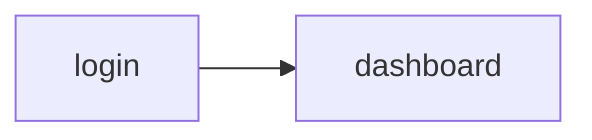

# Ordino agent memory

> Persistent locator cache for this project. Committed to git.

## Index

| URL | Page Object | Last Validated | Status | Hash (short) |
|---|---|---|---|---|
| /web/index.php/auth/login | LoginPage | 2026-05-12 | ✅ Working | _(pending hash)_ |
| /web/index.php/dashboard/index | DashboardPage | 2026-05-12 | ✅ Working | _(pending hash)_ |

---

## URL: https://opensource-demo.orangehrmlive.com/web/index.php/auth/login

- **Page Object:** `src/gui/pages/LoginPage.ts`
- **Spec:** `features/login.spec.ts`
- **Snapshot Hash:** `sha256:pending`
- **Last Validated:** 2026-05-12T07:45:00Z
- **Outgoing edges:**
  - `→ dashboard` via `LoginPage.step_login(users.admin)` (cost 2)

### usernameInput

- **Locator:** `//input[@name="username"]`
- **Source:** §3 CDP snapshot (Ordino browser)
- **Page Object Field:** `LoginPage.usernameInput`
- **Status:** ✅ Working
- **Validation Count:** 1
- **Last Validated:** 2026-05-12T07:45:00Z
- **History:**
  - `2026-05-12T07:45:00Z`: Smoke pass `features/login.spec.ts`

### passwordInput

- **Locator:** `//input[@name="password"]`
- **Source:** §3 CDP snapshot (Ordino browser)
- **Page Object Field:** `LoginPage.passwordInput`
- **Status:** ✅ Working
- **Validation Count:** 1
- **Last Validated:** 2026-05-12T07:45:00Z
- **History:**
  - `2026-05-12T07:45:00Z`: Smoke pass `features/login.spec.ts`

### loginButton

- **Locator:** `//button[@type='submit' and contains(@class,'orangehrm-login-button')]`
- **Source:** §3 CDP snapshot (Ordino browser)
- **Page Object Field:** `LoginPage.loginButton`
- **Status:** ✅ Working
- **Validation Count:** 1
- **Last Validated:** 2026-05-12T07:45:00Z
- **History:**
  - `2026-05-12T07:45:00Z`: Smoke pass `features/login.spec.ts`

---

## URL: https://opensource-demo.orangehrmlive.com/web/index.php/dashboard/index

- **Page Object:** `src/gui/pages/DashboardPage.ts`
- **Spec:** `features/login.spec.ts`
- **Snapshot Hash:** `sha256:pending`
- **Last Validated:** 2026-05-12T07:45:00Z

### dashboardNavActive

- **Locator:** `//a[contains(@class,'oxd-main-menu-item') and contains(@class,'active') and normalize-space(.)='Dashboard']`
- **Source:** §3 CDP snapshot (Ordino browser)
- **Page Object Field:** `DashboardPage.dashboardNavActive`
- **Status:** ✅ Working
- **Validation Count:** 1
- **Last Validated:** 2026-05-12T07:45:00Z
- **History:**
  - `2026-05-12T07:45:00Z`: Smoke pass `features/login.spec.ts`

---

## Navigation graph

```yaml
nav:
  login -> dashboard:
    via: LoginPage.step_login(users.admin)
    pre: authenticated=false
    cost: 2
    last_validated: 2026-05-12T07:45:00Z
    validation_count: 1
```



---

## Entities

```yaml
entities:
  User:
    attributes:
      - { name: username, type: string, required: true }
      - { name: password, type: string, required: true }
    pages:
      - { page: LoginPage, role: authenticates }
      - { page: DashboardPage, role: landing_after_login }
    test_data:
      - { name: admin, data: { username: 'Admin', password: 'admin123' } }
    last_validated: 2026-05-12T07:45:00Z
```

---

## Test data registry

```yaml
test_data:
  users.admin: { entity: User, data: { username: 'Admin', password: 'admin123' } }
```

---

## Feature index

```yaml
features:
  authentication:
    entities: [User]
    pages: [LoginPage, DashboardPage]
    nav_path: [login -> dashboard]
    test_data: [users.admin]
    spec: features/login.spec.ts
```

---

## Facts

```yaml
facts:
  - "Public demo BASE_URL is https://opensource-demo.orangehrmlive.com (OrangeHRM Live Demo)."
  - "Demo reset and logout use /web/index.php/auth/logout before each serial test."
```

## Deprecated

_(none)_
